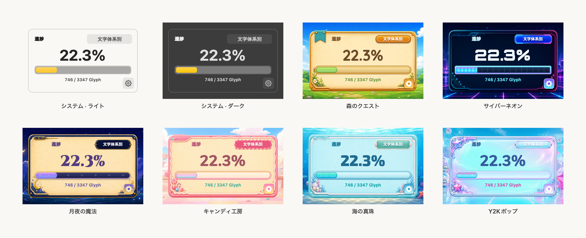
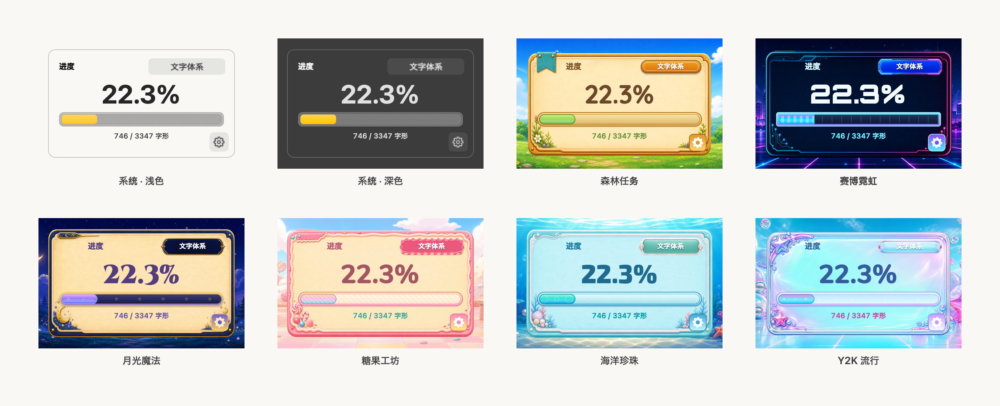
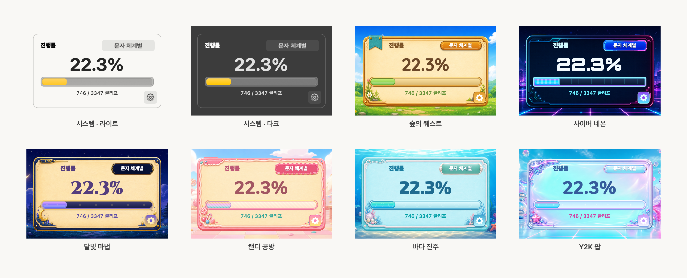
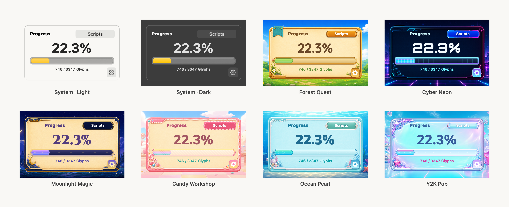

# GlyphQuest

[日本語](#日本語) | [简体中文](#简体中文) | [한국어](#한국어) | [English](#english)

---

## 日本語

GlyphQuest は、フォント制作の進捗を Glyphs 3 の右サイドバーに表示する Objective-C ネイティブ Palette プラグインです。全体の進捗と文字体系別の進捗を、ポップなゲーム UI 風の小さなパネルで確認できます。

### 機能

- **進捗表示**: 出力対象 Glyph の完成率をパーセントで表示
- **Glyph カウント**: 加重済みの完成 Glyph 数と対象 Glyph 数を表示
- **文字体系別表示**: `文字体系別` トグルでリスト表示に切り替え
- **テーマ切替**: 右下の設定ボタンから System / Forest / Cyber / Moonlight / Candy / Ocean / Y2K テーマを選択
- **スマートフィルタ**: 非出力 Glyph とスマートコンポーネント用 Glyph を除外
- **マスター単位スコア**: 全マスターに shapes があれば 1.0、一部のみの場合は部分点

### テーマ

同梱のデフォルトスキン（Forest / Cyber / Moonlight / Candy / Ocean / Y2K）の UI 画像アセットは、すべて Codex によって生成されたものです。**System** は PNG アセットなしで、macOS のシステム色に合わせて Light / Dark を自動追従します。



### インストール

1. このリポジトリをダウンロードまたは clone
2. `release/GlyphQuest.glyphsPalette` を Glyphs の Plugins フォルダにコピー:
   `~/Library/Application Support/Glyphs 3/Plugins/`
3. Glyphs 3 を再起動
4. **ウィンドウ → パレット** で **グリフクエスト** を表示

ビルド不要で、そのままインストールできます。

### 進捗の計算方法

対象 Glyph:

- `export` が有効
- `_part.` で始まらない
- スマートコンポーネント用レイヤーではない

スコア:

```text
percent = round(sum(glyph_scores) / eligible_glyph_count * 100, 1)
```

全マスターに shapes がある Glyph は `1.0`、一部マスターのみの場合は `作成済みマスター数 / 全マスター数` として数えます。

### 開発

リポジトリ構成:

```text
GlyphQuestPalette.h/.m   # Objective-C ソース
GQThemeSpec.h            # テーマ spec / プログレス API
GQThemeLoader.m          # JSON テーマ読み込み
GQProgressRenderer.m     # プログレスレイヤー描画
Info.plist
Resources/
  Fonts/                 # 同梱フォント + OFL.txt
  Themes/<id>/           # theme.yaml + PNG (JSON is build output)
scripts/compile_themes.py
GlyphQuest.xcodeproj/    # Xcode プロジェクト
release/                 # 配布用 Release ビルド（git 追跡）
build/                   # ローカルビルド中間物（git 無視）
```

Release ビルド:

```sh
xcodebuild -project GlyphQuest.xcodeproj -scheme GlyphQuest -configuration Release -derivedDataPath DerivedData SYMROOT=build OBJROOT=build/Intermediates build
```

テーマは `Resources/Themes/<id>/` に置きます。`theme.yaml` と PNG だけがソースで、ビルド時に bundle 内へ `theme.json` が生成されます（ソース横には置きません）。必須 PNG は `scene.png`、`card.png`、`toggle-off.png`、`toggle-on.png` です。新規テーマは既存フォルダをコピーして YAML と PNG を差し替えるだけで追加できます。トグル画像は文字なしで、表示テキストは Cocoa 側で描画します。

ビルド後、配布用 bundle を更新する場合:

```sh
rm -rf release/GlyphQuest.glyphsPalette
cp -R build/Release/GlyphQuest.glyphsPalette release/
```

### 動作環境

- Glyphs 3
- 開発時: Xcode、macOS 11.0 以降

### ライセンス

プラグイン本体: MIT License（[LICENSE](LICENSE)）

同梱フォント（Quicksand Bold、Orbitron Black、Cinzel Black、Nunito ExtraBold、Exo 2 ExtraBold）は [SIL Open Font License 1.1](Resources/Fonts/OFL.txt) で提供されています。フォントとライセンス全文は `Resources/Fonts/` および配布 bundle の `Contents/Resources/Fonts/` に同梱されています。

### 作者

**Palf**

- Email: palf@palf-official.com
- X: [@PALF_MovieWorks](https://twitter.com/PALF_MovieWorks)

---

## 简体中文

GlyphQuest 是一个适用于 Glyphs 3 的 Objective-C 原生 Palette 插件。它会在右侧边栏中显示字体制作进度，并用轻快的游戏风小面板展示整体进度和按文字体系分类的进度。

### 功能

- **进度显示**: 以百分比显示可导出字形的完成度
- **字形计数**: 显示加权后的已完成字形数和目标字形总数
- **文字体系视图**: 使用 `文字体系` 开关切换到分类列表
- **主题切换**: 通过右下角设置按钮选择 System / Forest / Cyber / Moonlight / Candy / Ocean / Y2K 主题
- **智能过滤**: 排除不可导出的字形和智能组件用字形
- **按母版计分**: 所有母版都有 shapes 时计为 1.0，部分完成时按比例计分

### 主题

内置默认皮肤（Forest / Cyber / Moonlight / Candy / Ocean / Y2K）的 UI 图片资源均由 Codex 生成。**System** 不使用 PNG 资源，并随 macOS 系统配色自动适配浅色 / 深色模式。



### 安装

1. 下载或 clone 此仓库
2. 将 `release/GlyphQuest.glyphsPalette` 复制到 Glyphs 插件文件夹:
   `~/Library/Application Support/Glyphs 3/Plugins/`
3. 重启 Glyphs 3
4. 在 **Window → Palette** 中显示 **Glyph Quest**

无需构建，可直接安装。

### 进度计算

计入目标的字形:

- `export` 已启用
- 名称不以 `_part.` 开头
- 不是智能组件用图层

公式:

```text
percent = round(sum(glyph_scores) / eligible_glyph_count * 100, 1)
```

所有母版都有 shapes 的字形计为 `1.0`。只有部分母版完成时，按 `已完成母版数 / 母版总数` 计分。

### 开发

仓库结构:

```text
GlyphQuestPalette.h/.m   # Objective-C 源码
GQThemeSpec.h            # 主题 spec / 进度条 API
GQThemeLoader.m          # JSON 主题加载
GQProgressRenderer.m     # 进度条图层渲染
Info.plist
Resources/
  Fonts/                 # 内置字体 + OFL.txt
  Themes/<id>/           # theme.yaml + PNG (JSON is build output)
scripts/compile_themes.py
GlyphQuest.xcodeproj/    # Xcode 项目
release/                 # 发布用 Release 构建（git 跟踪）
build/                   # 本地构建中间文件（git 忽略）
```

Release 构建:

```sh
xcodebuild -project GlyphQuest.xcodeproj -scheme GlyphQuest -configuration Release -derivedDataPath DerivedData SYMROOT=build OBJROOT=build/Intermediates build
```

主题位于 `Resources/Themes/<id>/`。源码只有 `theme.yaml` 和 PNG，构建时在 bundle 内生成 `theme.json`（不会出现在源码目录）。必需 PNG 为 `scene.png`、`card.png`、`toggle-off.png`、`toggle-on.png`。新增主题时复制现有文件夹并替换 YAML 与 PNG 即可。开关图片不包含文字，文字由 Cocoa 侧绘制。

构建后更新发布 bundle:

```sh
rm -rf release/GlyphQuest.glyphsPalette
cp -R build/Release/GlyphQuest.glyphsPalette release/
```

### 需求

- Glyphs 3
- 开发时: Xcode、macOS 11.0 及以上

### 许可证

插件本体: MIT License（[LICENSE](LICENSE)）

内置字体（Quicksand Bold、Orbitron Black、Cinzel Black、Nunito ExtraBold、Exo 2 ExtraBold）使用 [SIL Open Font License 1.1](Resources/Fonts/OFL.txt)。字体文件与许可证全文位于 `Resources/Fonts/` 及发布 bundle 的 `Contents/Resources/Fonts/` 中。

### 作者

**Palf**

- Email: palf@palf-official.com
- X: [@PALF_MovieWorks](https://twitter.com/PALF_MovieWorks)

---

## 한국어

GlyphQuest는 Glyphs 3 오른쪽 사이드바에서 글리프 제작 진행률을 보여 주는 Objective-C 네이티브 Palette 플러그인입니다. 전체 진행률과 문자 체계별 진행률을 작은 게임 UI 스타일 패널로 확인할 수 있습니다.

### 기능

- **진행률 표시**:내보내기 대상 글리프의 완성도를 퍼센트로 표시
- **글리프 카운트**: 가중치가 적용된 완성 글리프 수와 대상 글리프 수 표시
- **문자 체계별 보기**: `문자 체계별` 토글로 목록 표시 전환
- **테마 전환**: 오른쪽 아래 설정 버튼에서 System / Forest / Cyber / Moonlight / Candy / Ocean / Y2K 테마 선택
- **스마트 필터**:내보내지 않는 글리프와 스마트 컴포넌트용 글리프 제외
- **마스터별 점수**: 모든 마스터에 shapes가 있으면 1.0, 일부만 있으면 비율로 계산

### 테마

포함된 기본 스킨(Forest / Cyber / Moonlight / Candy / Ocean / Y2K)의 UI 이미지 에셋은 모두 Codex로 생성되었습니다. **System**은 PNG 에셋 없이 macOS 시스템 색을 따르며 Light / Dark를 자동 전환합니다.



### 설치

1. 이 저장소를 다운로드하거나 clone
2. `release/GlyphQuest.glyphsPalette`를 Glyphs 플러그인 폴더로 복사:
   `~/Library/Application Support/Glyphs 3/Plugins/`
3. Glyphs 3 재시작
4. **Window → Palette** 에서 **Glyph Quest** 표시

빌드 없이 바로 설치할 수 있습니다.

### 진행률 계산

대상 글리프:

- `export`가 켜져 있음
- 이름이 `_part.`로 시작하지 않음
- 스마트 컴포넌트용 레이어가 아님

공식:

```text
percent = round(sum(glyph_scores) / eligible_glyph_count * 100, 1)
```

모든 마스터에 shapes가 있는 글리프는 `1.0`으로 계산합니다. 일부 마스터만 완성된 경우 `완성된 마스터 수 / 전체 마스터 수`로 계산합니다.

### 개발

저장소 구조:

```text
GlyphQuestPalette.h/.m   # Objective-C 소스
GQThemeSpec.h            # 테마 spec / 진행률 API
GQThemeLoader.m          # JSON 테마 로더
GQProgressRenderer.m     # 진행률 레이어 렌더러
Info.plist
Resources/
  Fonts/                 # 번들 폰트 + OFL.txt
  Themes/<id>/           # theme.yaml + PNG (JSON is build output)
scripts/compile_themes.py
GlyphQuest.xcodeproj/    # Xcode 프로젝트
release/                 # 배포용 Release 빌드 (git 추적)
build/                   # 로컬 빌드 중간 산출물 (git 무시)
```

Release 빌드:

```sh
xcodebuild -project GlyphQuest.xcodeproj -scheme GlyphQuest -configuration Release -derivedDataPath DerivedData SYMROOT=build OBJROOT=build/Intermediates build
```

테마는 `Resources/Themes/<id>/`에 둡니다. 소스는 `theme.yaml`과 PNG만 포함하며, 빌드 시 bundle 안에 `theme.json`이 생성됩니다(소스 옆에는 두지 않음). 필수 PNG는 `scene.png`, `card.png`, `toggle-off.png`, `toggle-on.png`입니다. 새 테마는 기존 폴더를 복사해 YAML과 PNG만 바꾸면 됩니다. 토글 이미지는 글자 없이 만들고, 텍스트는 Cocoa 쪽에서 그립니다.

빌드 후 배포 bundle 업데이트:

```sh
rm -rf release/GlyphQuest.glyphsPalette
cp -R build/Release/GlyphQuest.glyphsPalette release/
```

### 요구 사항

- Glyphs 3
- 개발 시: Xcode, macOS 11.0 이상

### 라이선스

플러그인 본체: MIT License（[LICENSE](LICENSE)）

포함된 폰트(Quicksand Bold, Orbitron Black, Cinzel Black, Nunito ExtraBold, Exo 2 ExtraBold)는 [SIL Open Font License 1.1](Resources/Fonts/OFL.txt)로 제공됩니다. 폰트 파일과 라이선스 전문은 `Resources/Fonts/` 및 배포 bundle의 `Contents/Resources/Fonts/`에 포함되어 있습니다.

### 제작자

**Palf**

- Email: palf@palf-official.com
- X: [@PALF_MovieWorks](https://twitter.com/PALF_MovieWorks)

---

## English

GlyphQuest is a native Objective-C Palette plugin for Glyphs 3. It shows font completion progress in the right sidebar with a compact, playful game-style panel for both overall progress and writing-system progress.

### Features

- **Progress display**: Shows completion across exportable glyphs as a percentage
- **Glyph count**: Shows weighted completed glyphs against the total target glyphs
- **Writing-system view**: Toggle `Scripts` to switch to the writing-system list
- **Theme switching**: Choose System / Forest / Cyber / Moonlight / Candy / Ocean / Y2K themes from the bottom-right settings button
- **Smart filtering**: Excludes non-export glyphs and smart-component glyphs
- **Per-master scoring**: A glyph scores 1.0 only when every master has shapes; partial completion is weighted

### Themes

All UI image assets for the bundled default skins (Forest / Cyber / Moonlight / Candy / Ocean / Y2K) were generated by Codex. **System** uses no PNG artwork and follows macOS system colours for Light / Dark appearance.



### Installation

1. Download or clone this repository
2. Copy `release/GlyphQuest.glyphsPalette` to your Glyphs plugins folder:
   `~/Library/Application Support/Glyphs 3/Plugins/`
3. Restart Glyphs 3
4. Open **Window → Palette** and show **Glyph Quest**

No build step is required for installation.

### Progress Calculation

Eligible glyphs:

- `export` is enabled
- Name does not start with `_part.`
- Not a smart-component layer

Formula:

```text
percent = round(sum(glyph_scores) / eligible_glyph_count * 100, 1)
```

A glyph scores `1.0` when every master has shapes. Partial completion is counted as `drawn_masters / total_masters`.

### Development

Repository layout:

```text
GlyphQuestPalette.h/.m   # Objective-C source
GQThemeSpec.h            # Theme spec / progress API
GQThemeLoader.m          # JSON theme loader
GQProgressRenderer.m     # Progress layer renderer
Info.plist
Resources/
  Fonts/                 # Bundled fonts + OFL.txt
  Themes/<id>/           # theme.yaml + PNG (JSON is build output)
scripts/compile_themes.py
GlyphQuest.xcodeproj/    # Xcode project
release/                 # Shipped Release build (tracked in git)
build/                   # Local build intermediates (git-ignored)
```

Release build:

```sh
xcodebuild -project GlyphQuest.xcodeproj -scheme GlyphQuest -configuration Release -derivedDataPath DerivedData SYMROOT=build OBJROOT=build/Intermediates build
```

Themes live in `Resources/Themes/<id>/`. Source contains `theme.yaml` and PNGs only; the build generates `theme.json` inside the app bundle, not beside the YAML in the repo. Required PNGs are `scene.png`, `card.png`, `toggle-off.png`, and `toggle-on.png`. To add a theme, copy an existing folder and replace the YAML and PNGs. Toggle images are textless; Cocoa draws the localized label.

After building, refresh the shipped bundle:

```sh
rm -rf release/GlyphQuest.glyphsPalette
cp -R build/Release/GlyphQuest.glyphsPalette release/
```

### Requirements

- Glyphs 3
- For development: Xcode, macOS 11.0 or later

### License

Plugin: MIT License ([LICENSE](LICENSE))

The bundled fonts (Quicksand Bold, Orbitron Black, Cinzel Black, Nunito ExtraBold, Exo 2 ExtraBold) are licensed under the [SIL Open Font License 1.1](Resources/Fonts/OFL.txt). The font files and full licence text are included in `Resources/Fonts/` and in the shipped bundle at `Contents/Resources/Fonts/`.

### Author

**Palf**

- Email: palf@palf-official.com
- X: [@PALF_MovieWorks](https://twitter.com/PALF_MovieWorks)
